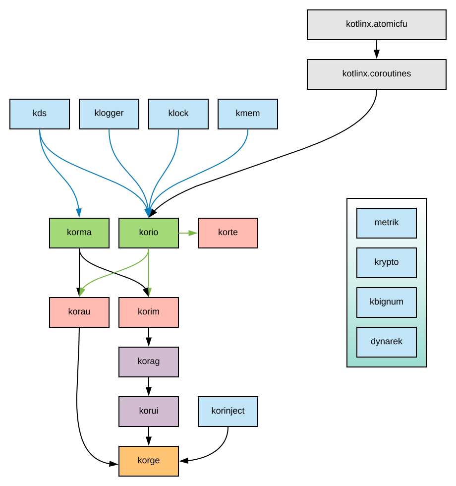

# docs.korge.org

To launch locally:

You can either:

## Option 1: [install jekyll](https://jekyllrb.com/docs/installation/)

Then execute `jekyll s`

## Option 2: [install docker](https://docs.docker.com/get-docker/)

Then execute `./jekyll.sh` or `jekyll2.bat`

