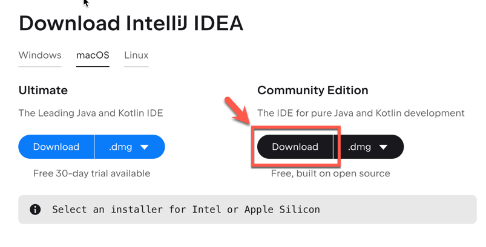
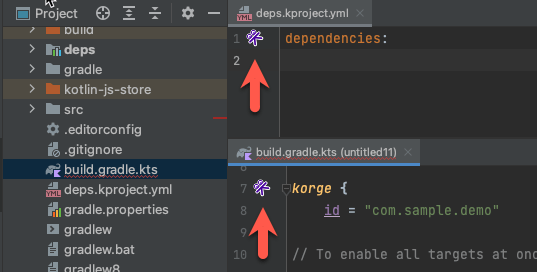
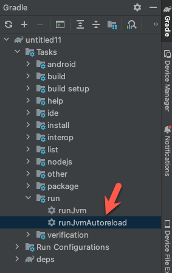

## Welcome to KorGE

Korge is a multiplatform game engine, 
that includes libraries for game development and other areas, 
an [asset & library store](https://store.korge.org/),
starter kits,
and an [IntellIJ plugin](https://plugins.jetbrains.com/plugin/9676-korge) to improve the workflow.

Getting started with KorGE is really simple.

## Quickstart

### 1. Install IntelliJ IDEA

* <https://www.jetbrains.com/idea/download/> - Community Edition will work

### 2. Install the KorGE **IntelliJ IDEA plugin**:

You can click here to install the plugin:

<iframe frameborder="none" width="245px" height="48px" src="https://plugins.jetbrains.com/embeddable/install/9676"></iframe>

Or download the plugin from the [KorGE Plugin page](https://plugins.jetbrains.com/plugin/9676-korge).

### 3. Install one of the starter kits or samples available using the `New Project...` Wizard:

You can select one of the `Starter Kits` or one of the `Showcases` with a full game:

### 4. Access the KorGE Store

In order to access some KorGE features, you can install them via the KorGE Store.

You can access that store via: <https://store.korge.org/>

Or inside the IntelliJ Plugin navigation bar:

Or when opening your `build.gradle.kts` or your `deps.kproject.yml`:

### 5. Running your code

When creating a new project a new run configuration `runJvmAutoreload` should be available:

You can also `double click` on the `Gradle` → `Tasks` → `run` → `runJvmAutoreload`
to create a run configuration and execute your program:

## Next Steps

Now that you have a working environment, let's explore other concepts. 

1. Take your [first steps](firststeps) learning to create a sample game with basic shapes.
2. Then build a more complex and realistic game with a [step-by-step tutorial to build a 2048 game](firstgame).
3. Finally, [deploy it in one of our supported platforms](/korge/deployment).

From there you can get a deep look to the [reference documentation](/korge/reference).

## Asking Questions and Solving Doubts

You can ask questions in:

* [Discord Community](https://discord.korge.org/)
* [Github Discussions](https://github.com/korlibs/korge/discussions)

We have a nice and welcoming community! Feel free to drop in.
